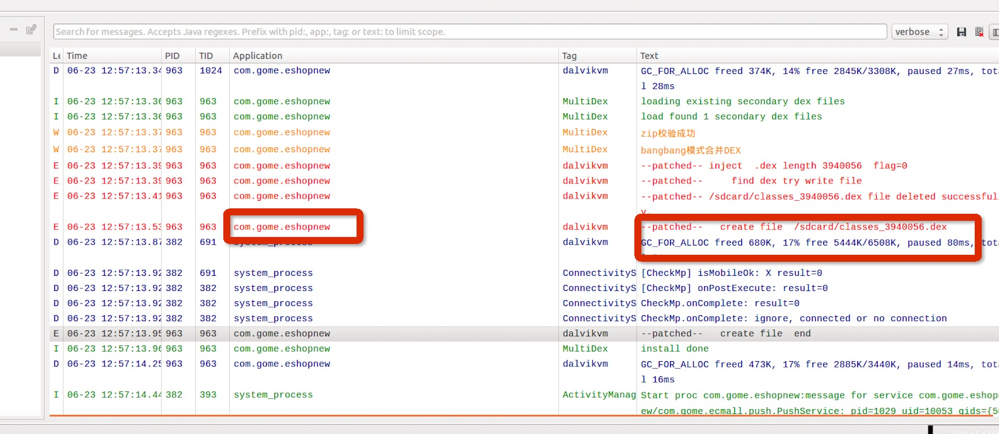

# DexExtractor
android dex脱壳 
1支持梆梆加固
2支持爱加密

## usgae
push libdvm.so android4.4模拟器 /system/lib

  模拟器镜像下载[Google Drive](https://drive.google.com/file/d/0B4IvHmkRqgS4Nlh5WmVhRU9aNlE/view?usp=sharing) (or Download For Chinese User  [百度云](http://pan.baidu.com/s/1jG3WQMU))

  md5：6395c2f1451dbbed027d7293ab39a6e7

使用 -scard参数启动模拟器
adb  install  安装加固后的apk
打开logcat  logcat
监视log被加固的包名和dvmtag，如图 , 当you will see  create file end.
  adb  pull /sdcard/classes_xxx.dex 拖出

文件base64编码了，解码odex，java -jar Decoder.jar dex目录
所有的odex(梆梆加固)
爱加密出来的是dex
